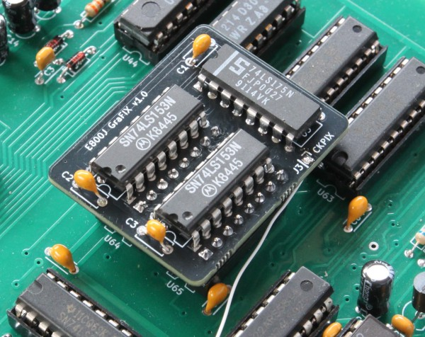
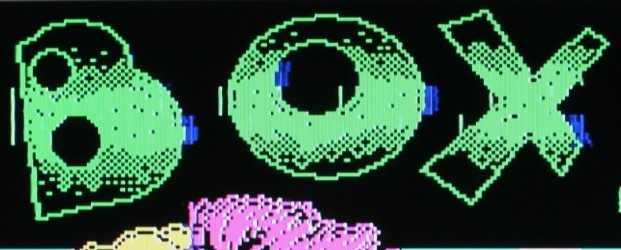
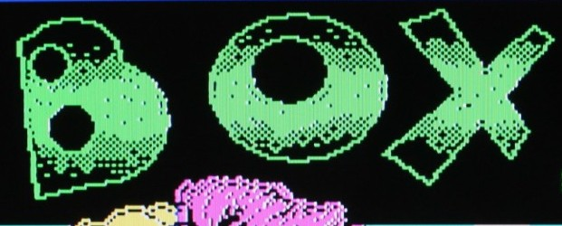
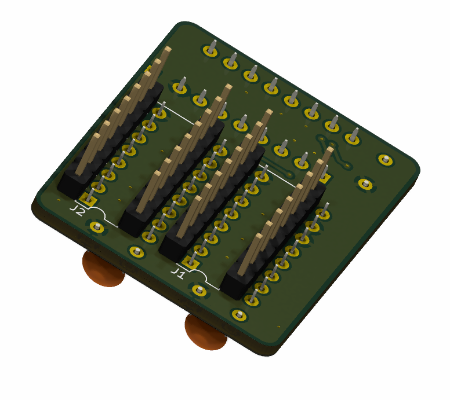
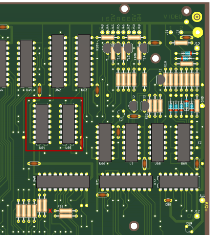

# Elwro 800 Junior - GraFIX

The purpose of this tiny project is to fix a design flaw in the [Elwro 800 Junior](https://pl.wikipedia.org/wiki/Elwro_800_Junior) that causes visible graphical artifacts.

In this repo:

* schematic/PCB project in KiCAD 8 format (in this very directory)
* PDF schematics - [color](grafix_sch.pdf) and [black&white](grafix_sch_bw.pdf)
* [interactive BOM](grafix_ibom.html) file (you have to download it and open locally)
* Gerber files (in a [jlcpcb](https://jlcpcb.com/)-compatible ZIP format):
  * [grafix.zip](gerbers/grafix.zip) - single PCB
  * [grafix_2x_panel.zip](gerbers/grafix_2x_panel.zip) - two PCBs panelized

## The problem & solution

The pictures below were taken before and after installing the `GraFIX` PCB. . In the first screenshot, green and blue artifacts are clearly visible around the green letters (other examples [here](img)). 

Junior uses the same screen organization as the ZX Spectrum - every consecutive group of 8 pixels shares the same ink and paper color pair, the pixel value determines whether it is displayed in the ink or paper color. Junior employs two `74LS153` multiplexers for the color selection, this is a purely combinatorial circuit, unfortunately, leading to occasional short (~30ns) glitches visible as artifacts.

Fortunately, the multiplexer outputs remain stable around the rising edges of the `CKPIX` (pixel clock) signal. The `GraFIX` mod adds a 4-bit register (`74LS175`) at the multiplexer outputs, clocked by `CKPIX` (pixel clock) signal. This effectively latches a stable color value for each pixel, eliminating the glitches.

## Assembling

When soldering the PCB, follow this order: pin headers under `U2`, then `U2` itself, followed by pin headers under `U1`, and finally `U1`. Soldering all the pin headers first makes it difficult to solder pins 9 to 16 of `U2` due to the small gap between the inner pin headers (been there, done that). See below:

Then you have to unsolder `74LS153` multiplexers and replace them with `DIL-16` sockets, now you can insert `GraFIX` PCB into the sockets. The last step is to connect `J3` header on the `GraFIX` board to `CKPIX` signal on the Junior PCB with a short piece of wire. The best place to do it is a via close to `R38`, marked with red `X`. That's it!

